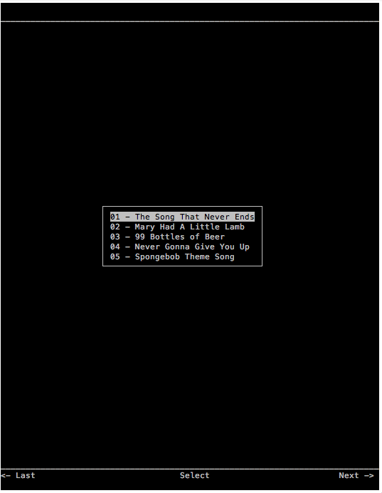
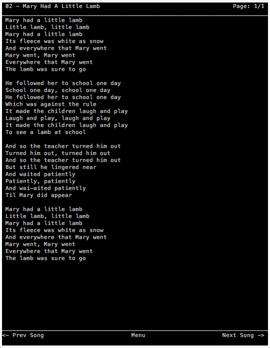
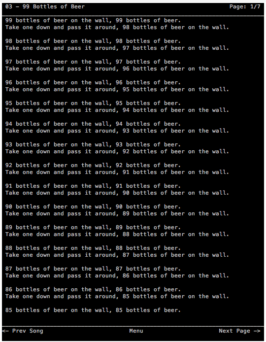
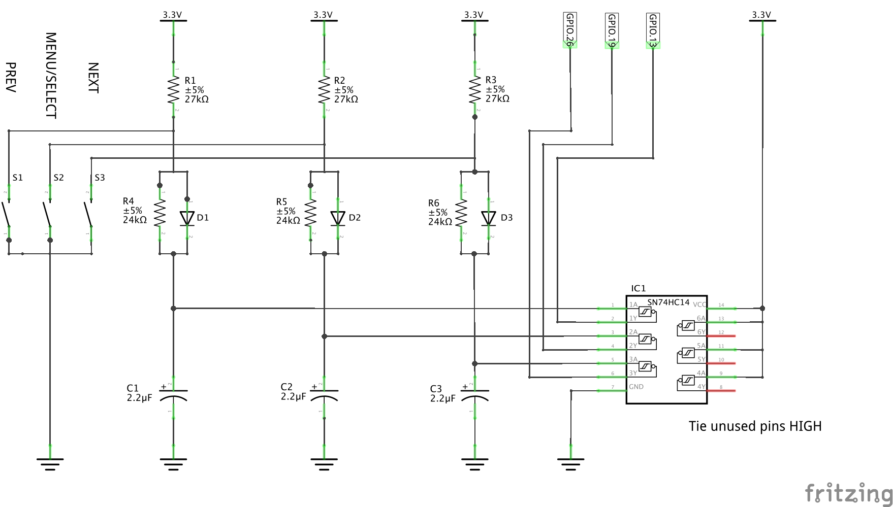
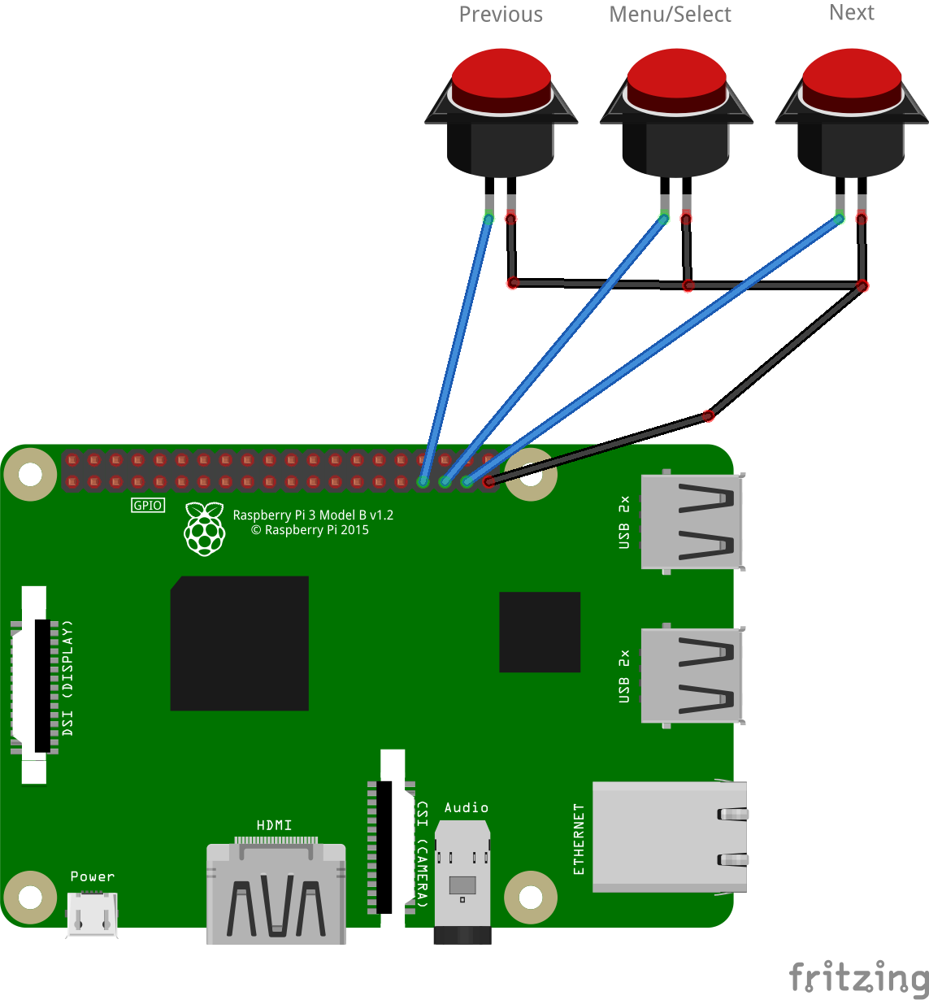

# Lyric Prompter for on Stage 

Changes to Origial Project:
 1. Used on a TinyCore Linux / PiCore to run only from RAM (SD Card Read only) and to have fast boot time
 2. Added Colorization of Lyrics ( with Tags like `<red>`, `<blue>`, ...)
 3. center aligned text output
 4. use 4 Buttons Menue ( From my opinion original 3 Key control is better but previous Project is already in use and has 4 Keys Keyboard)
 5. Use Arrow Keys instead of GPIOs ( External USB Footswitch Keyboard emulates the four arrow Keys Up, Down, Left, Right with an Arduino )
 

 Following Steps to use in PiCore:
 
 Please follow instructions of PiCore installation.
 http://tinycorelinux.net/5.x/armv6/releases/README?ref=itsfoss.com
Currently testet with PiCore 14.1.0 on an RPi 3B+
used image: http://tinycorelinux.net/14.x/armv7/releases/RPi/

important: 
  resize2fs /dev/mmcblk0p2  -> otherwise not enough space will be available
  default Password: piCore
  do not forget to run filetool.sh -b to make the changes persistent

installed / needed tcz Packages:
ncurses-terminfo
python3.11
socat

update /opt/filelist.lst with rule location (/etc/udev/rules.d/) -> to make mount / unmount rule persistent

#### Setup autorun (Important change!!! Otherwise default terminal input is the pipe and not the terminal -> Arrow Keys / handling will not work)
Add the following to ~/.profile
```nano
setfont /usr/share/consolefonts/Lat15-TerminusBold32x16.psf.gz
LDIR=$(find /media -maxdepth 2 -type d -name 'lyrics')

if [ -d "$LDIR" ]; then
    python3 ~/on-stage-lyrics-browser/bin/lyricsbrowser.py "$LDIR"
else
    python3 ~/on-stage-lyrics-browser/bin/lyricsbrowser.py
fi
```


This is just a first quick and dirty modification and extension for my personal use. Feel free to contact me if something is quite too dirty and should be fixed. 
Project is under construction and not fully ready to use.

ToDo: 
code optimization 
intensive and stage tests
maybe copy files to ram buffer to allow removal of USB stick / interruption of USB Stick


# -----------------(Original Text)-------------
The On Stage Lyrics Browser is a footswitch-controlled teleprompter 
 system for live performance. Its based on the Raspberry Pi and provides
 a simple curses-based interface to list text files from a USB flash 
 drive directory and display their content.

The collection of scripts here, installed on a Raspberry Pi, 
will produce a basic, text-based browser for lyrics on a USB device.

[Setup](#to-install) is fairly straightforward, and
 [preparing the files/USB flashdrive](#to-use) are simple. Interfacing
 [pedals](#hardware) with the Raspberry PI takes a little bit
 of work to operate properly, but is not an overly complex task.
 
The following screenshots show the two views available: Set List and
Lyrics View:

<p align="center">
  
</p>

<p align="center">
  
</p>

 
## Software Included:
 * a udev rule to auto mount/umount USB upon insertion/removal
 * a script that controls the interface display functions
 * a script that sends mount information to the interface
 * a script that sends umount information to the interface
 
You will also find schematics in the img directory to assist with
 building debounce circuits, or to illustrate how to connect 
 footswitches without hardware debouncing.

## To install:
This assumes a recent copy of Raspian is installed and everything is
default.

#### Configure networking
Connect your PI to a network and be sure you can access APT repositories.
This does not need to persist beyond initial setup.

#### Install dependencies
```sh
$ sudo apt install -y python3-rpi.gpio git
```

#### Install scripts
```sh
$ cd ~
$ git clone https://github.com/joshuabettigole/on-stage-lyrics-browser.git
$ chmod +x on-stage-lyrics-browser/bin/*
```

#### Rotate screen
This works best with the screen orientation rotated 90° or 270°
```sh
$ sudo nano /boot/config.txt
```
Add one of the following:
```nano
display_rotate=1
display_rotate=3
```

#### Symlink udev rules
```sh
$ sudo ln -s ~/on-stage-lyrics-browser/etc/udev/rules.d/* /etc/udev/rules.d/
```

#### Setup autorun
Add the following to ~/.profile
```nano
setfont /usr/share/consolefonts/Lat15-TerminusBold32x16.psf.gz
LDIR=$(find /media -maxdepth 2 -type d -name 'lyrics' -print0 -quit 2> /dev/null)

if [ -d $LDIR ]; then
        echo -n $LDIR | ~/on-stage-lyrics-browser/bin/lyricsbrowser.py
else
        ~/on-stage-lyrics-browser/bin/lyricsbrowser.py
fi
```
This sets the font size to something reasonably large - feel free to modify.
It also looks to see if a USB was present and mounted during boot, checks
for a lyrics directory, and passes that directory along to start the 
interface script upon login.

#### Setup autologin, disable network on boot
```sh
$ sudo raspi-config\
```

To boot directly to the lyrics browser, enable autologin
> Boot Options -> Desktop/CLI -> Console Autologin

To save time on bootup, disable networking
> Boot Options -> Wait for Network at Boot -> No

#### Restart
Reboot your Pi and if all worked, you should see the lyrics browser
after a few moments.

## To use:
#### USB Formatting
* The USB flash drive you use should be FAT formatted, with or without
partitioning.
* On the flash drive, you should have a <strong>lyrics</strong>
directory (all lowercase)
* Within the <strong>lyrics</strong> directory, the lyrics files need to
be placed in alphabetical order. The easiest way to do this is to number
them.
```sh
pi@raspberry:/media/usbhd-sda $ ls -l lyrics
total 64
-rwxrwxr-x 1 root users  1679 Oct  3  2018 01 - The Song That Never Ends.txt
-rwxrwxr-x 1 root users   869 Oct 11  2018 02 - Mary Had A Little Lamb.txt
-rwxrwxr-x 1 root users 11886 Oct 11  2018 03 - 99 Bottles of Beer.txt
-rwxrwxr-x 1 root users   735 Oct 11  2018 04 - Never Gonna Give You Up.txt
-rwxrwxr-x 1 root users   414 Oct 11  2018 05 - Spongebob Theme Song.txt
```

#### File Formatting
Files must be in .txt format (.rtf and .doc do not work). At
some point in the future, support for adding colors will be considered.

If lyric lines are too long to fit within the width of the page, line
breaks will be added and additional lines will be prefixed with " - ".

If lyrics for one song are too long to fit on one page, subsequent pages
will be added, as necessary, for browsing. The lower right corner of the
screen will display <strong>"Next Page ->"</strong> and the upper right 
corner displays the current page number: <strong>"Page #/##"</strong>
<p align="center">
  
</p>

#### Starting
Upon bootup, if a USB device is present, it should be mounted and the
lyrics directory path (if it exists) passed to the browser script. 

If no USB device is present at boot, the browser should alert you to 
<strong>Insert USB Media</strong>. When a USB device is inserted, the 
browser will be notified and will automatically display the set list.

A USB device can be removed and reconnected at any point. The browser 
will be notified and act accordingly. Since the USB filesystem is 
mounted Read-Only, there should be no ill-effect from removal without
proper unmounting.

#### Browsing
The browser depends on GPIO interrupts for navigation. There is no 
facility for keyboard browsing. Three buttons/pedals are necessary to
use the full features of the program, <strong>Previous</strong>, 
<strong>Menu/Select</strong>, and <strong>Next</strong>. The 
<strong>Previous</strong> button/pedal can be omitted at the cost of 
ease of navigation. See the [Hardware](#hardware) section for
details.

When using the browser, the bar across the bottom of the screen
displays what each of the three buttons would do in any given context.
When lyrics are displayed for a specific song, the top bar displays the
song title and page information.

#### Localization
Interface language is in English (sorry, that's all I know). If you 
care to modify the language for your locale, modify the strings in the 
_e dictionary within the bin/lyricsbrowser.py file:
```python
# Setup language strings
_e = {
    'welcome': "Welcome",
    'load_media': "Insert USB Media",
    'select': "Select",
    'menu': "Menu",
    'next': "Next",
    'prev': "Prev",
    'first': "First",
    'last': "Last",
    'prev_page': "Prev Page",
    'prev_song': "Prev Song",
    'next_page': "Next Page",
    'next_song': "Next Song",
    'page': "Page"
}
```

#### Advanced

The browser runs a socket server that listens for the lyrics directory
path to be passed in. It's possible to script Next, Previous, and 
Menu/Select with 3rd-party software or custom scripts of your choosing.
By sending 'n', 'p', or 'm' to /tmp/lyricsbrowser.sock, the browser
responds accordingly.

NEXT command
```sh
echo -n 'n' | nc -w1 -U /tmp/lyricsbrowser.sock 
```
PREVIOUS command
```sh
echo -n 'p' | nc -w1 -U /tmp/lyricsbrowser.sock 
```
MENU/SELECT command
```sh
echo -n 'm' | nc -w1 -U /tmp/lyricsbrowser.sock 
```


## Hardware
#### Requirements:
A properly configured Raspberry Pi attached to a widescreen monitor is
a start. A keyboard and network connection is required to get past the
installation process, but then should not be required at all.

A three button/pedal box of your own choosing. Buttons/pedals should be 
normally open (normally closed untested).

While some attempts are made in code to handle switch debouncing, there
is still risk that one button cycle can advance multiple pages. It is 
<strong>HIGHLY</strong> recommend that a simple debounce circuit be 
added between the PI and the pedals/buttons. The following schematic
outlines a fairly effective debounce circuit:

<p align="center">
  
</p>

[See Schematic](./img/debounce_schematic.png)

Without a hardware debounce circuit, the pedals/buttons should be
connected from ground (pin 39) to:

* Previous: GPIO 13
* Menu: GPIO 19
* Next: GPIO 26

(these are pins 33,35,37)

<p align="center">
  
</p>

The exact GPIO pins can be altered in the bin/lyricsbrowser.py file
```python
gpiopin_prev = 13
gpiopin_next = 26
gpiopin_menu = 19
```

## TODO:
* Work on a way to format text with color/bold. There is still no plan
to use anything but .txt files, however.
* Build a shell script to simplify install.
* Preconfigured Raspberry PI OS image
* Provide a hardware list
* Offer pre-built debounce interface

## License:
The On Stage Lyrics Browser is licensed under the terms of the GNU Affero
General Public License v3.0 and is available for free. See the
[License](./LICENSE) for details.

## Credits:
udev rules adapted from:\
https://www.axllent.org/docs/view/auto-mounting-usb-storage/

switch debounce circuit from:\
https://www.logiswitch.net/switch-debounce-diy_tutorial/method-4-hardware-debounce-for-spst-switches

rotating the raspberry pi screen from:\
https://www.raspberrypi-spy.co.uk/2017/11/how-to-rotate-the-raspberry-pi-display-output/